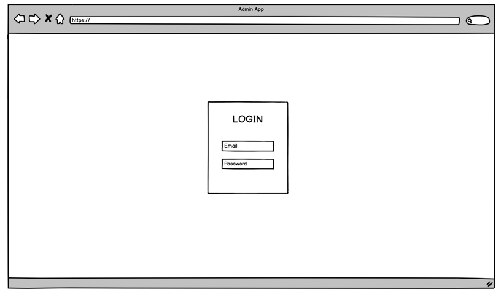
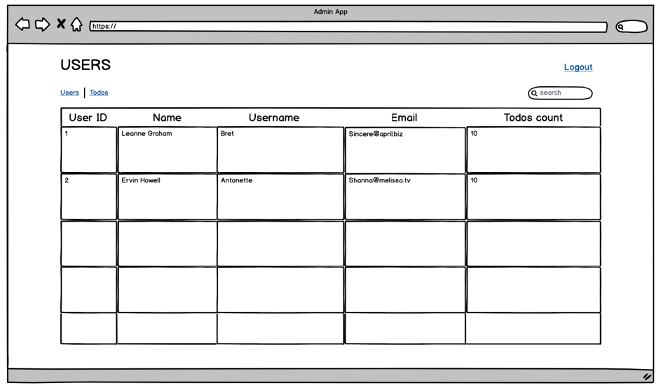
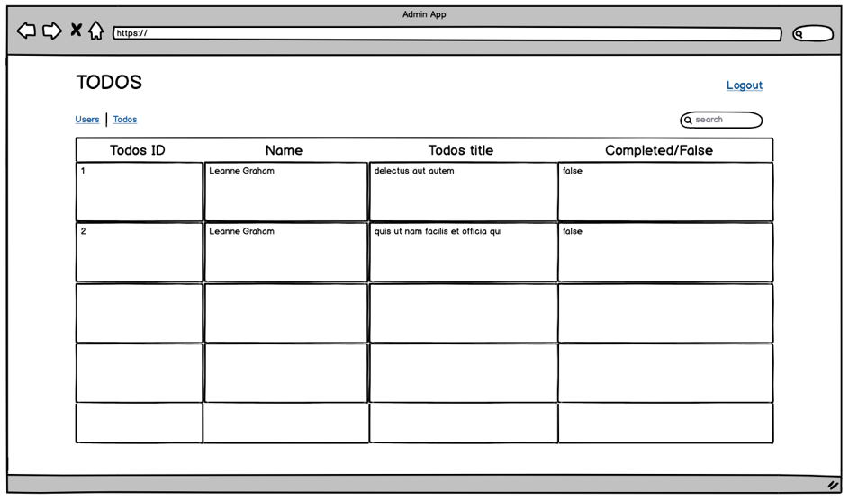

# Admin App

## Description

Your goal is to create an administration panel for JSONPlaceholder resources.
JSONPlaceholder is an online fake REST API for Testing and Prototyping.

JSONPlaceholder: https://jsonplaceholder.typicode.com/

You should use React as a library for creating Admin App.
For styling, you can not use adaptations like React-Bootstrap, but you may use CSS libraries like Bootstrap or SemanticUI.

The application should consist of the following:

1. Login page
2. Users page
3. Todo page

### Login page
This screen should consist of Login authentication.
For this purpose, you may use hardcoded credentials.

User should log in with his/her email and password. Please use email validation for user input in the email field.
On wrong credentials input, a message should be shown to the user.

Example below:

### Users page
Users page should consist of a data table with the following information:
User ID, Name, Username, Email, Todos count

The following columns should be searchable and sortable (both in ascending and descending order), one at the time: 
Name, Username, Email.

User should be able to click on the name of the user. On the click, all information available for the specific User from the User Json should be presented in the popup window.

Example below:

### Todos page
Todos page should consist of a data table with the following information:
Todos ID, User name, title, completed/false.
 
User should be able to click on the title of Todo. On the click, all information available for the specific Todo from the Todo Json should be presented in the popup window.
 
The following columns should be searchable and sortable (both in ascending and descending order), one at the time: 
Name, Username, Title, Email.

Example below:

### There should be Menu available in both Users and Todo's pages.
Menu should consist of Users, Todos links, Search and Logout options as shown in the above examples.

## Definition of done
* Working solution on your private repository

## You will fail

* If you use styling adaptations libraries like React-Bootstrap
