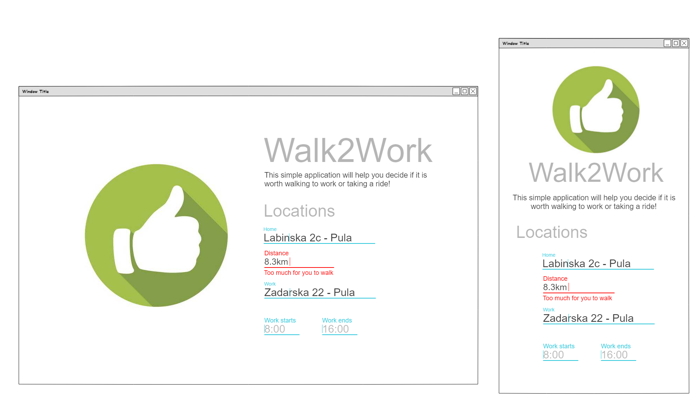

# Walk2Work app (SPA)

## Overview
The client requested us to create a simple app that would help his employees decide to come to work, by walking or by car. The decision would be made by taking into consideration weather conditions when going to work and coming back and time needed for the walk. 

Goals:  
* Help employee not to get wet

## Specifications

When the user lands on the page/app he would be presented with a simple user interface, consisting of a form, background image, phone image and a block of text. The block of text will be the name of the app and some explanation on how it works. Since it is a SPA (single page app), there is no need for a navigation, also, scrolling should not be possible since all user interactions will be handled with a form and the results displayed as two possible icons on a mobile phone image. 
The user can insert the estimated distance from home to work or you can use google directions API to calculate. (Note that you will have to create an account yourself or find another solution)

Use weather api to get hourly weather predictions.

* Technology constraints
    * Plain JS
        * Using React is a bonus
    * CSS
        * Bootstrap or Materialize
        * Plain CSS - bonus
    * Browser support
        * Chrome - just Chrome
* Design
    * Use  as reference
    * Imagery
        * Background image ok/not-ok.png
    * UI
        * Materialize
    * Breakpoints
        * Desktop > 992px
        * Mobile < 992px
* Data
    * Google Directions API - bonus (ask HR for API key)
        * If not used, remove fields from App
    * Weather API
        * You are free to use any service you like. Openweather is optional.
        * Openweathermap.org
            * API key - 598122f549b8d002e936a1cb908b9b1e
            * If the key provided is not working, open an account or send us an email.
    * Form
        * Home & Work location 
            * Input text
            * Autocomplete - bonus
            * Not needed if not using Google Directions API
        * Distance
            * Max value equals to 1h of walk
            * Walk speed 5.5 km/h
    * Icon
        * Two images representing 
            * Green - is ok to walk to work
                * If certainty in the period of walking for rain is below 25%
            * Red - probably not a good idea
                * If certainty in the period of walk for rain is greater than 75%
* Notifications - optional (will require backend)
    * Push
        * Pusher.com as suggestion
        * Of your own choosing
